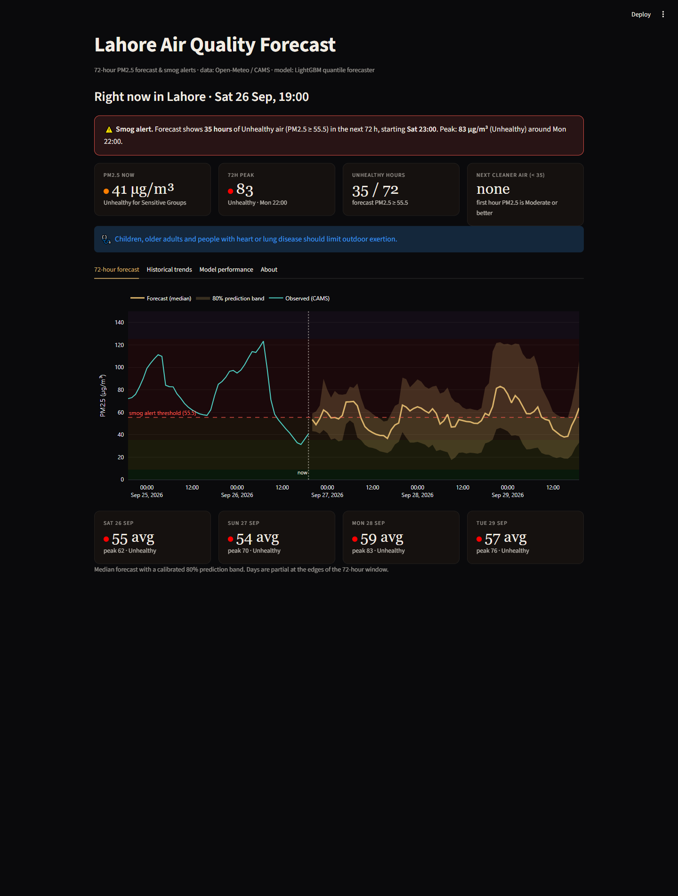
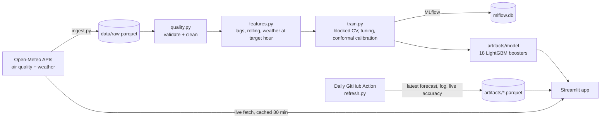
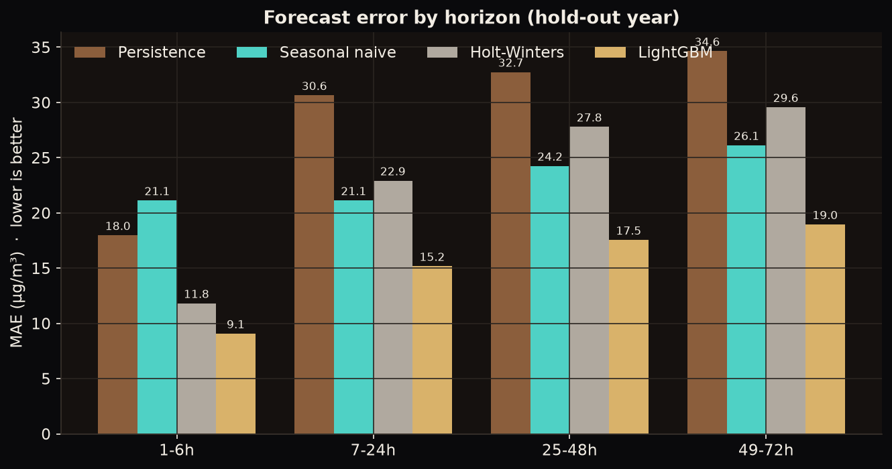
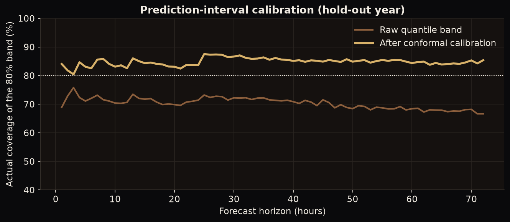
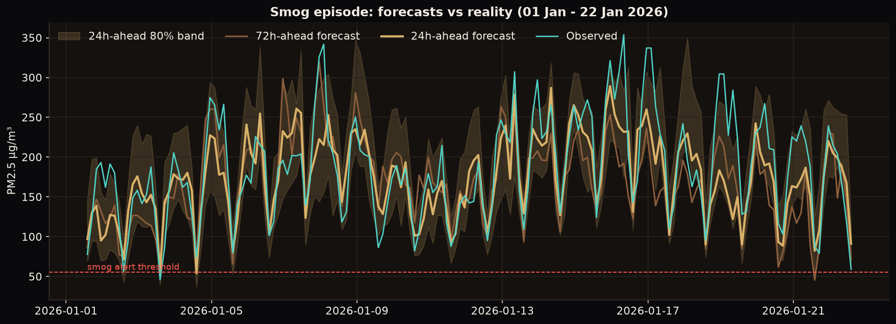
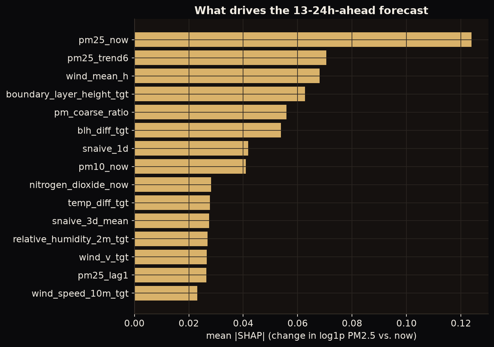

# Lahore Air Quality Forecasting & Smog-Alert System

72-hour PM2.5 forecasts for Lahore with calibrated uncertainty, AQI-category alerts, a daily automated refresh and an interactive Streamlit dashboard.

**Live demo:** [https://lahore-air-quality-forecasting-ktsbxbedmucrla85wxm8vn.streamlit.app/](https://lahore-air-quality-forecasting-ktsbxbedmucrla85wxm8vn.streamlit.app/) · **Stack:** Python, LightGBM, DuckDB, MLflow, Streamlit, GitHub Actions



## 1. Business problem

Lahore's winter smog is a chronic public-health problem: in the data used here, **53% of all hours are "Unhealthy" or worse** (PM2.5 ≥ 55.5 µg/m³, US EPA 2024 breakpoints). Schools, outdoor businesses, event planners and families need to know *in advance* which days and hours to avoid.

| | |
|---|---|
| **Stakeholder** | School administrators, small outdoor businesses, city health desks, citizens |
| **Decision supported** | Move/cancel outdoor activity, plan mask use, schedule deliveries, issue alerts |
| **Success KPIs** | (1) Catch "Unhealthy" hours ahead of time (alert recall & precision); (2) beat the "same as yesterday" rule of thumb at every horizon; (3) honest 80% uncertainty band |

## 2. Data

| Source | Content | Licence |
|---|---|---|
| [Open-Meteo Air Quality API](https://open-meteo.com/en/docs/air-quality-api) | Hourly PM2.5, PM10, NO₂, SO₂, O₃, CO, dust, aerosol depth (CAMS) | CC BY 4.0, no API key |
| [Open-Meteo Historical Weather API](https://open-meteo.com/en/docs/historical-weather-api) | Temperature, humidity, dew point, wind, pressure, cloud, precipitation, boundary-layer height (ERA5) | CC BY 4.0, no API key |
| [Open-Meteo Forecast API](https://open-meteo.com/en/docs) | Weather forecast for the next 3 days (used at inference time) | CC BY 4.0 |

* 36,355 usable hourly rows, 2022-08-04 → 2026-09-26.
* **Important caveat:** the pollution values are *atmospheric-model output* (CAMS, ~10 km grid), **not ground-sensor readings**. They track real conditions but can differ from a street-level monitor or the US Embassy sensor.
* Quality checks (`src/aqforecast/quality.py`, `artifacts/quality_report.json`): no duplicate/missing timestamps; 37 ozone values outside the plausible range nulled; the first 77 hours have no pollutants (dropped); `boundary_layer_height` is missing for Jan–Jun 2024 (12%; LightGBM handles NaN natively).

## 3. Architecture



## 4. Approach

**Framing.** Direct multi-horizon forecasting: one training row per *(forecast origin, horizon 1…72 h)*. Features known at the origin: PM2.5 lags (1 h … 7 days), rolling mean/std/min/max, trends, other pollutants, current weather; plus the **weather at the target hour** (from the weather forecast in production), calendar features and two seasonal-naive reference values.

**Models compared** (all on the same hold-out):
1. Persistence (last value)
2. Seasonal naive (same hour yesterday) and 3-day mean of that hour
3. Holt-Winters (additive damped trend, 24 h seasonality, refit at each origin) - statistical baseline
4. **LightGBM quantile models** predicting the change in `log1p(PM2.5)` from now: 6 horizon buckets × 3 quantiles (q10/q50/q90) = 18 models

**Design choices that mattered (found by experiment, not assumed):**
* A single global model was ~3× worse at 1 h ahead than a short-horizon model → **separate models per horizon bucket**.
* Predicting the *change from now* rather than the level.
* The raw quantile band under-covered (62-70%) → **conformalised quantile regression** using out-of-fold residuals from 4 time-series CV blocks widens the band per horizon bucket.

**Validation (no leakage).** Blocked expanding-window CV (4 × 120-day blocks) with training targets fully before each block, used for random-search tuning (9 configs) and for conformal calibration. A **final hold-out of the most recent 365 days** (2025-09-26 → 2026-09-26, contains a full smog season) is never used for tuning. The deployed model is then refit on all data. Tests check that changing PM2.5 *after* the forecast origin cannot change any feature.

**Experiment tracking.** MLflow (local SQLite): one parent run, 9 nested trial runs with params and CV MAE, final metrics and artifacts. Best trial: 500 trees, lr 0.05, 15 leaves, min_child_samples 50, feature_fraction 0.7, λ₂ = 10 (CV MAE 16.83; all 9 trials fell between 16.83 and 17.11, so tuning barely mattered).

## 5. Results (hold-out year, real numbers from `artifacts/metrics.json`)

| Model | MAE µg/m³ | RMSE | R² |
|---|---|---|---|
| Persistence | 31.6 | 45.1 | 0.22 |
| Seasonal naive (yesterday) | 24.7 | 35.8 | 0.51 |
| Seasonal naive (3-day mean) | 23.8 | 34.3 | 0.55 |
| **LightGBM (median)** | **16.7** | **24.3** | **0.77** |

Holt-Winters is slow to refit, so it was evaluated on a shared random sample of 150 hold-out origins: **MAE 25.8** vs 16.7 for LightGBM and 23.1 for seasonal-naive on the same sample.

**MAE by horizon (µg/m³)**

| Model | 1-6 h | 7-24 h | 25-48 h | 49-72 h |
|---|---|---|---|---|
| Seasonal naive (3-day) | 21.1 | 21.1 | 24.2 | 26.1 |
| Holt-Winters (sample) | 11.8 | 22.9 | 27.8 | 29.6 |
| **LightGBM** | **9.1** | **15.2** | **17.5** | **19.0** |



**Smog alerts ("Unhealthy or worse", 53% of hours in the hold-out)**

| | Precision | Recall | F1 | Category accuracy |
|---|---|---|---|---|
| Seasonal naive (3-day) | 0.77 | 0.80 | 0.79 | 54% |
| **LightGBM, all horizons** | **0.86** | **0.82** | **0.84** | 64% (98% within one category) |
| LightGBM, 1-6 h | 0.93 | 0.90 | 0.92 | 80% |
| LightGBM, 49-72 h | 0.83 | 0.79 | 0.81 | 60% |

**Uncertainty.** The raw q10-q90 band covered 70.3% of hold-out hours. After conformal calibration it covers **84.8%** (target 80%). On the out-of-fold calibration data coverage was 80.0%, so the band is slightly conservative (wider than necessary) on the hold-out year; mean width 56.6 µg/m³.



**Smog season vs rest of year (LightGBM MAE / seasonal-naive MAE):** Nov-Feb 23.1 / 36.8; rest of year 13.6 / 17.4. Absolute error is larger in smog season because levels are higher (relative error WAPE: 20.1% vs 25.3%).



## 6. Key insights

* **Seasonality dominates:** monthly mean PM2.5 is 140 µg/m³ in January vs 36 in April; 98% of January days and 93% of December days have a daily mean ≥ 55.5.
* **Weather explains the swings:** low wind, a collapsed boundary layer, cold temperature and high humidity go with the worst pollution (winter inversions).
* **What drives the forecast (SHAP, 13-24 h model):** current PM2.5, the 6-hour trend, mean wind over the horizon, forecast boundary-layer height and its change, and the PM2.5/PM10 ratio (a proxy for combustion vs dust).
* **Skill grows with weather information:** the biggest gains over seasonal-naive come at 1-24 h, but LightGBM still cuts MAE by ~27% at 49-72 h.



## 7. Limitations & honest caveats

* **Modelled, not measured:** targets are CAMS model output. Validate against local sensors before any safety-critical use.
* **Optimistic weather at training time:** for the horizon, training uses ERA5 *reanalysis* weather as the "forecast" at the target hour. In production, real forecasts are noisier, so live accuracy at 24-72 h will be somewhat worse than the hold-out numbers. The daily job logs every forecast and computes live MAE against what actually happened (`artifacts/live_accuracy.json`; still empty right after deployment).
* **Band is conservative** on the hold-out year (84.8% vs 80% target).
* **Extreme peaks are under-predicted:** on Hazardous hours (PM2.5 ≥ 225.5, 3,960 hold-out hours) the median forecast is 48 µg/m³ too low on average, while Good/Moderate hours are slightly over-predicted (+11 / +9); alerts are calibrated for "Unhealthy or worse", not for exact peak size.
* **Single grid cell** for the whole city; no neighbourhood-level forecast.
* Boundary-layer height is missing for Jan-Jun 2024 in the archive.

## 8. Next steps

Scheduled monthly retraining (the job exists as a CLI; the workflow is not added), ground-sensor blending (e.g. AirNow/US Embassy feed if a free source is available), conformal recalibration on live errors, a 7-day horizon, and SMS/WhatsApp alert delivery.

## 9. Repository layout

```
src/aqforecast/   config, ingest, quality, features, models, evaluate, aqi, inference, train, refresh, report, viz
app/              Streamlit dashboard (dark/gold theme)
notebooks/        01_eda.ipynb, 02_modeling.ipynb (executed)
tests/            pytest: quality checks, leakage guard, feature alignment, models, metrics, AQI logic
artifacts/        small committed files: deployed model (14 MB), metrics.json, latest forecast, daily history
reports/figures/  charts used in this README and the portfolio
.github/workflows ci.yml (ruff + pytest on every push), refresh.yml (daily forecast refresh)
Dockerfile        container for the app
```

## 10. How to run

```bash
uv sync --all-groups && uv pip install -e .
uv run python -m aqforecast.ingest        # download ~4 years of hourly data (~1 min)
uv run python -m aqforecast.train         # tuning + CV + hold-out + refit (~25 min on an 8-core laptop CPU)
uv run python -m aqforecast.report        # figures + SHAP
uv run pytest -q && uv run ruff check .   # tests + lint
uv run streamlit run app/streamlit_app.py # dashboard (fetches live data)
uv run mlflow ui --backend-store-uri sqlite:///mlflow.db   # experiment tracker
docker build -t lahore-aq . && docker run -p 8501:8501 lahore-aq
```

Deploy for free on Streamlit Community Cloud: point it at `app/streamlit_app.py` (dependencies come from `requirements.txt`).

_Data © Open-Meteo.com (CC BY 4.0), CAMS/Copernicus and ERA5/ECMWF. This is a decision-support tool, not medical advice._
